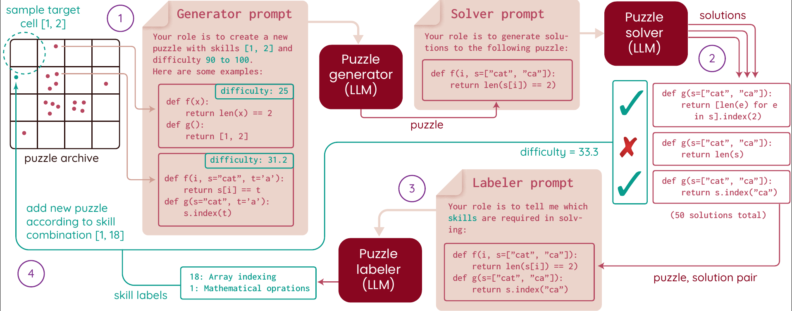

# aces
Implementation of the ACES paper: ([Generating a Diversity of Challenging Programming
Puzzles with Autotelic Generative Models](https://openreview.net/pdf?id=L1mMK39Z7P))

## Abstract
The ability to invent novel and interesting problems is a remarkable feature of
human intelligence that drives innovation, art, and science. We propose a method
that aims to automate this process by harnessing the power of state-of-the-art
generative models to produce a diversity of challenging yet solvable problems,
here in the context of Python programming puzzles. Inspired by the intrinsically
motivated literature, Autotelic CodE Search (ACES) jointly optimizes for the
diversity and difficulty of generated problems. We represent problems in a space of
LLM-generated semantic descriptors describing the programming skills required
to solve them (e.g. string manipulation, dynamic programming, etc.) and measure
their difficulty empirically as a linearly decreasing function of the success rate of
Llama-3-70B, a state-of-the-art LLM problem solver. ACES iteratively prompts
a large language model to generate difficult problems achieving a diversity of
target semantic descriptors (goal-directed exploration) using previously generated
problems as in-context examples. ACES generates problems that are more diverse
and more challenging than problems produced by baseline methods and three
times more challenging than problems found in existing Python programming
benchmarks on average across 11 state-of-the-art code LLMs.




## Installation steps
1. (Recommended) Create a new conda environment.
```
conda create -n aces python=3.11 -y
conda activate aces
```
2. Install vLLM (see [vllm installation for latest info](https://docs.vllm.ai/en/latest/getting_started/installation.html))
```
pip install vllm 
```
3. install ACES
```
git clone https://github.com/flowersteam/aces.git; cd aces; pip install -e .

```

## Run Aces
See examples scipts in or notebook to launch experiment with local or API LLMs [examples](examples/p3/).
Example for SLURM cluster at (slurm)[examples/p3/slurm_script/]


📦 ACES  
┣ 📂 [`aces`](babyai-text) -- *ACES code*    
┃ ┣ 📂 [`environement`](aces/environement) -- *file containing code specific to each environement*    
┣ 📂 [`examples`](examples) -- *code for our experiments*    
┃ ┣ 📂 [`p3`](examples/agents) -- *implementation of all our agents*    
┃ ┃ ┣ 📂 [`slurm_script`](examples/agents/slurm_script)  -- *bot agent leveraging BabyAI's bot*    
┃ ┃ ┣ 📜 [`launch_p3_local.ipynb`](examples/agents/slurm_script/launch_p3.ipynb)  -- *Notebook to launch ACES P3 (local mode)*    
┃ ┃ ┣ 📜 [`launch_p3_API.ipynb`](examples/agents/slurm_script/launch_p3.ipynb)  -- *Notebook to launch ACES P3 (OpenAI API mode)*    
┃ ┃ ┗ 📜 [`launch_p3.py`](examples/agents/slurm_script/launch_p3.ipynb)  -- *Notebook to launch ACES P3*    
┣ 📂 [`save_data`](save_data) -- *Folder where data is saved*    
┃ ┗ 📜 [`launch_p3.ipynb`](save_data/check_data.ipynb)  -- *Notebook to explore results*    
